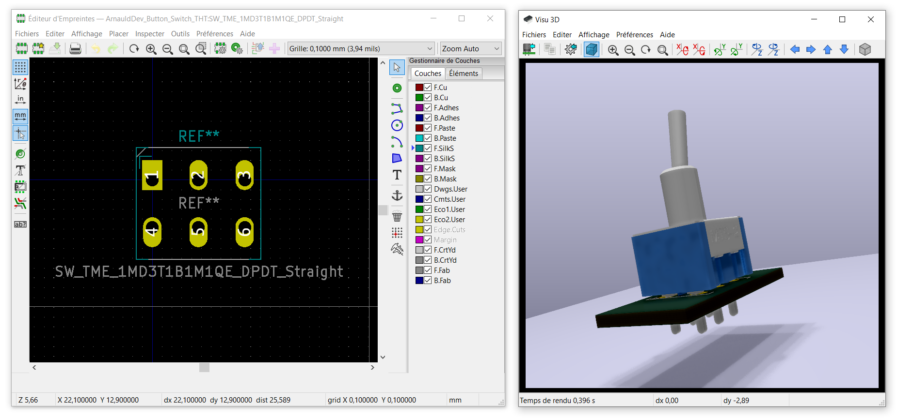

# 1MD3T1B1M1QE

[Interrupteur à levier, On-Off-On, 2RT, 5 A @ 28 V c.c.](https://www.tme.eu/en/details/1md3t1b1m1qe/toggle-switches/)

## Sourcing

| Fournisseur   |                                     Code Commande                                     | Description                                                                               | Minimum commande |
| :------------ | :-----------------------------------------------------------------------------------: | :---------------------------------------------------------------------------------------- | :--------------: |
| Farnell       | [9473530](https://fr.farnell.com/multicomp/1md3t1b1m1qe/interrupteur-dpdt/dp/9473530) | Commutateur à bascule, On-Off-On, DPDT, Non lumineux, Série 1MD, Montage sur panneau, 5 A |        1         |
| RS Components |       [401-692](https://fr.rs-online.com/web/p/interrupteurs-a-levier/0401692/)       | Interrupteur à levier RS PRO, On-Off-On, 2RT, 5 A @ 28 V c.c.                             |        1         |